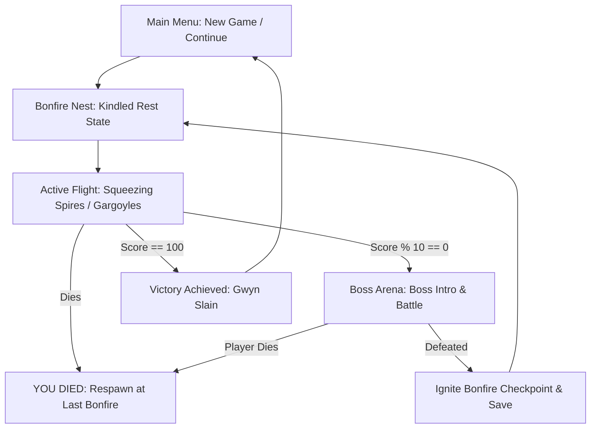

# GAME DESIGN DOCUMENT (GDD)
## Project Name: Flappy Souls (Godot Flappy Bird MCP)
**Author:** Antigravity (AI Coding Assistant) & Yusuf Ağaç  
**Engine:** Godot Engine 4.6.2 (GDScript)  
**Platform:** Windows PC / Headless / AI-Managed  

---

## 1. Executive Summary & Concept
**Flappy Souls** is an atmospheric, premium gothic action-arcade game built on top of the classic Flappy Bird formula, infused with **Dark Souls** themes, high-stakes progression, and native **Model Context Protocol (MCP)** support for autonomous AI control.

Instead of an endless high-score chase, the player guides a kindled ember bird through a linear, increasingly hostile 100-level gauntlet divided into 10 distinct regions, each guarded by a legendary boss.

---

## 2. Core Game Loop

1. **Rest at Bonfire:** Player prepares, Kindles fireballs, and flaps to launch.
2. **Venture Forth:** Fly through scrolling dynamic columns, dodge gargoyles, and collect Estus Flasks.
3. **Boss Confrontation:** Triggered every 10 points. Spawner halts, and a parameterized boss re-emerges with unique attack behaviors.
4. **Ignite Bonfire:** Defeating a boss updates the checkpoint, saves to disk (`user://savegame.data`), and loads Kindled fireballs.

---

## 3. Game Mechanics & Entities

### 3.1 Player Character (The Bird)
*   **Physics:** Gravitational acceleration (900 px/s²) with flap-velocity (-320 px/s). Rotational tilt reacts to speed (Rotates up when flap, nose-dives when falling).
*   **Combat:** When **Kindled** (Estus Flask collected), flaps also shoot a **Soul Fireball** straight forward.
*   **Death:** Single hit kills player (ground collision, column, gargoyle, or boss projectiles/dashes).

### 3.2 Obstacles (Gothic Spires)
*   **Static Spires:** Normal dark stone columns.
*   **Vertical Bobbing Spires:** Oscillate up and down using a sine wave.
*   **Horizontal Sliding Spires:** Oscillate side-to-side to narrow or widen flight timing.
*   **Diagonal Orbit Spires:** Combined vertical and horizontal movement.
*   *Note:* Obstacle difficulty scales with the player's score.

### 3.3 Enemy Units (Gargoyles)
*   Flying bats that flap dynamically and move horizontally leftward to intercept the player. Can be destroyed by firing Soul Fireballs.

### 3.4 Power-Ups (Estus Flasks)
*   Bobbing glowing gold/orange bottles that kindle the player on contact, giving 5–8 Soul Fireball charges.

---

## 4. The 10 Boss Tiers (Level 10 - 100)

Each tier represents a legendary Souls boss with customized procedural visual art, color palettes, and attack behaviors:

| Tier | Score Trigger | Boss Name | Aesthetic | Primary Attack |
| :--- | :---: | :--- | :--- | :--- |
| **1** | 10 | **ASYLUM DEMON** | Moss Green / Grey | Straight Dark Fireballs, Slow charge dash |
| **2** | 20 | **BELL GARGOYLE** | Copper Bronze | Zigzag Fireballs, Aggressive vertical sweeps |
| **3** | 30 | **CAPRA DEMON** | Charcoal / Bone | Circular expanding fireball rings, Body charge |
| **4** | 40 | **GAPING DRAGON** | Fleshy Pink / Ribs | Volcanic ground magma eruptions, Cross explosions |
| **5** | 50 | **CHAOS WITCH QUELAAG** | Molten Red / Lava | Meteors falling from the sky |
| **6** | 60 | **GREAT GREY WOLF SIF** | Moonlight Blue / Grey | Tracking homing magic spheres, Sweeping dashes |
| **7** | 70 | **IRON GOLEM** | Cast Iron / Rust | Twisting spiral wave projectiles |
| **8** | 80 | **ORNSTEIN** | Golden Armor / Cyan | Lightning-fast zigzag lightning shots |
| **9** | 90 | **GRAVELORD NITO** | Shadow Black Shroud | Volcanic ground eruptions & meteor showers |
| **10** | 100 | **LORD GWYN** | Blinding Orange / Ash | Solar lava lasers, Homing spheres, Giant rings |

---

## 5. UI/UX & Art Direction
*   **Color Palette:** Dominated by deep charcoals, dark crimson, obsidian, and glowing embers (golden-orange/gold).
*   **Main Menu:** High-contrast gothic title "FLAPPY SOULS" with a dark overlay panel. Features clickable buttons with orange glowing borders on hover.
*   **HUD Elements:** 
    *   **Score & High Score** labels using desaturated gray text.
    *   **Progress Indicator:** A linear slider on a dark frame displaying the target boss name.
    *   **YOU DIED:** Dramatic dark red screen-fade upon player death.
    *   **BONFIRE LIT:** Glowing golden text displaying when checkpoints are achieved.

---

## 6. Technical & MCP Integration Architecture

*   **Communication:** A WebSocket Client (`mcp_client.gd`) in the game connects to a Python FastAPI/FastMCP server (`mcp_server.py`) at `ws://localhost:8765`.
*   **Telemetry Telecast:** Game state (bird X/Y, velocity, next pipes gap coordinates, score, state) is broadcasted at 20Hz.
*   **Remote Execution:** External agents can read state, trigger z-flaps, pause, resume, or force game restarts.
